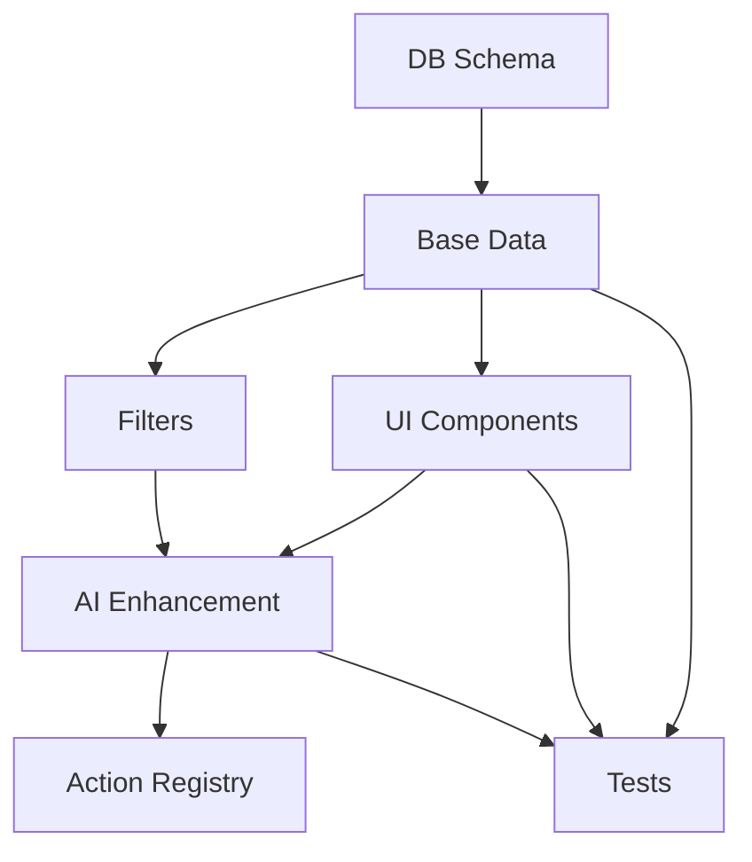

## NSW Government RAG Career Intelligence System — Overview

### Purpose

To build a public-facing, AI-powered career exploration and workforce mobility platform using a Retrieval-Augmented Generation (RAG) architecture. This will help individuals navigate NSW Government careers and provide departments with workforce insights and planning tools.

### Core Components

#### Role Pages

* Summary of responsibilities, required capabilities, skills, classification, and agency/division.
* Links to related roles and transitions.

#### Transition Pages

* Explain how to move from one role to another.
* Highlights gaps and readiness, with AI-generated development plans.

#### General Role Ontology

* Groups similar roles across agencies.
* Enables shared transitions and planning across variants.

#### Skills and Capabilities Pages

* Describe what each skill/capability is.
* Show where it is required and how to develop it.

#### Career Pathways Graph

* Visual progression paths.
* Lateral, vertical, and pivot opportunities.

#### Faceted Discovery

* Filter content by:

  * Taxonomy (function or theme)
  * Region
  * Division
  * Classification level
  * Skill/capability

#### Public UX Entry Points

* Start with Role / Person / Insight / Conversation
* Search or filter entry via homepage

#### Sidebar Dynamics

* Filter panel or history depending on context
* Dynamically changes across pages

#### RAG Engine

* Index job ads, roles, skills, capabilities, transitions.
* Embed and retrieve content semantically.
* Use prompt templates to generate natural language outputs.

### Use Cases

* Career development for public sector staff
* Internal mobility and retention
* Department-level planning
* Public awareness of role opportunities

### Optional Add-Ons

* Resume matching
* Talent dashboards
* Inclusion insights (e.g. First Nations, remote roles)
* Predictive vacancy or gap detection

### Next Steps

* Finalize data sources
* Wireframe all major page types
* Implement caching and generation workflows
* Pilot across a lead agency (e.g. DCCEEW)

---

## Implementation Plan

### Phase 1: Core Foundation
**Goal:** Establish fundamental data structures and basic functionality
**Features:**
- General Roles
- Specific Roles
- Role Transitions
- Capabilities
- Data Edge Function
- Frontend Data Service
- Filter System
- Caching Layer

**Success Criteria:**
- ✓ Database schema implemented for core entities
- ✓ Basic CRUD operations working
- ✓ Data edge function operational
- ✓ Initial filtering system in place
- ✓ Basic caching implemented
- ✓ Core entity relationships established

### Phase 2: Extended Features & Infrastructure
**Goal:** Build out secondary features and strengthen infrastructure
**Features:**
- Skills
- Taxonomies
- Capability Requirements
- Skill Requirements
- Error Handling
- Monitoring

**Success Criteria:**
- ✓ Skills and taxonomies fully integrated
- ✓ Requirements system operational
- ✓ Frontend service layer complete
- ✓ Error handling implemented
- ✓ Monitoring systems in place
- ✓ UI components for all Phase 2 features

### Phase 3: Advanced Features & Optimization
**Goal:** Implement AI-powered features and optimize performance
**Features:**
- Career Pathways
- Capability Heatmaps
- Skill Gap Analysis
- Performance Optimization
- Documentation

**Success Criteria:**
- ✓ AI enhancement layer operational
- ✓ Advanced analytics features working
- ✓ Performance metrics meeting targets
- ✓ Documentation complete
- ✓ System optimized for scale

## Implementation Progress Tracker

| Entity/Feature              | Phase  | DB Schema | Action | Action Registry | UI Components | Filters | AI Enhancement | Tests | Done |
|----------------------------|:------:|:---------:|:---------:|:-------------:|:-------:|:--------------:|:---------------:|:-----:|:----:|
| **Phase 1 Features**       |        |           |           |               |         |                |                 |       |      |
| General Roles              |   1    |    ✅    |    ✅    |      ✅      |   ✅    |       ✅       |     N/A         |  ✅   |  ✅  |
| Specific Roles             |   1    |    ✅    |    ✅    |      ✅      |   ✅    |       ✅       |     N/A         |  ✅   |  ✅  |
| Role Transitions           |   1    |    ✅    |    ✅    |      ✅      |   ✅    |       ✅       |      ✅         |  ⬜   |  🟨  |
| Capabilities               |   1    |    ✅    |    ✅    |      ✅      |   ✅    |       ✅       |      ⬜         |  ✅   |  ✅  |
| Data Edge Function         |   1    |    ✅    |    ✅    |      ✅      |   ✅    |       ✅       |      N/A        |  ✅   |  ✅  |
| Frontend Data Service      |   1    |    ✅    |    ✅    |      ✅      |   ✅    |       ✅       |      N/A        |  ✅   |  ✅  |
| Filter System              |   1    |    ✅    |    ✅    |      ✅      |   ✅    |       ✅       |      N/A        |  ✅   |  ✅  |
| Caching Layer              |   1    |    ✅    |    ✅    |      ✅      |   ✅    |       N/A      |      N/A        |  ✅   |  ✅  |
| **Phase 2 Features**       |        |           |           |               |         |                |                 |       |      |
| Companies                  |   2    |    ✅    |    ✅    |      ✅      |   ✅    |       ⬜       |      N/A        |  ⬜   |  🟨  |
| Skills                     |   2    |    ✅    |    ⬜    |      ⬜      |   ✅    |       ⬜       |      ⬜         |  ⬜   |  🟨  |
| Taxonomies                 |   2    |    ✅    |    ⬜    |      ⬜      |   ✅    |       ⬜       |      N/A        |  ⬜   |  🟨  |
| Error Handling             |   2    |    ⬜    |    ⬜    |      ⬜      |   ⬜    |       ⬜       |      N/A        |  ⬜   |  ⬜  |
| Monitoring                 |   2    |    ⬜    |    ⬜    |      ⬜      |   ⬜    |       N/A      |      N/A        |  ⬜   |  ⬜  |
| **Phase 3 Features**       |        |           |           |               |         |                |                 |       |      |
| Career Pathways            |   3    |    ⬜    |    ⬜    |      ⬜      |   ⬜    |       ⬜       |      ⬜         |  ⬜   |  ⬜  |
| Capability Heatmaps        |   3    |    ⬜    |    ⬜    |      ⬜      |   ⬜    |       ⬜       |      ⬜         |  ⬜   |  ⬜  |
| Skill Gap Analysis         |   3    |    ⬜    |    ⬜    |      ⬜      |   ⬜    |       ⬜       |      ⬜         |  ⬜   |  ⬜  |
| Performance Optimization   |   3    |    ⬜    |    ⬜    |      ⬜      |   ⬜    |       N/A      |      N/A        |  ⬜   |  ⬜  |
| Documentation             |   3    |    ⬜    |    ⬜    |      ⬜      |   ⬜    |       N/A      |      N/A        |  ⬜   |  ⬜  |

### Legend
- ⬜ Not Started
- 🟨 In Progress
- ✅ Complete
- ❌ Blocked
- N/A Not Applicable

### Recent Updates:
- Role Transitions: DB Schema, Actions, and Action Registry completed
- Role Transitions: UI Components, Filters, and AI Enhancement in progress
- General Roles & Specific Roles: Marked AI Enhancement as N/A (data-driven features)
- Added N/A status to features where AI Enhancement or Filters are not applicable

### Dependencies

### Risk Mitigation

1. **Data Quality**
   - Early validation of data sources
   - Clear data cleaning procedures
   - Regular data quality checks

2. **Performance**
   - Performance budgets defined
   - Monitoring from day one
   - Caching strategy validated

3. **Cost Control**
   - AI usage monitoring
   - Cost thresholds defined
   - Optimization triggers identified

4. **User Experience**
   - Progressive enhancement ensures basic functionality
   - Clear loading states
   - Graceful degradation paths

### Review Points

Define success criteria met when:
- All automated tests passing
- Performance metrics within budget
- Accessibility requirements met
- Security review completed
- Documentation updated
- User acceptance criteria met

### Monitoring Metrics

Track for each phase:
- Error rates
- Response times
- Cache hit rates
- AI cost per request
- User engagement metrics
- System load metrics
