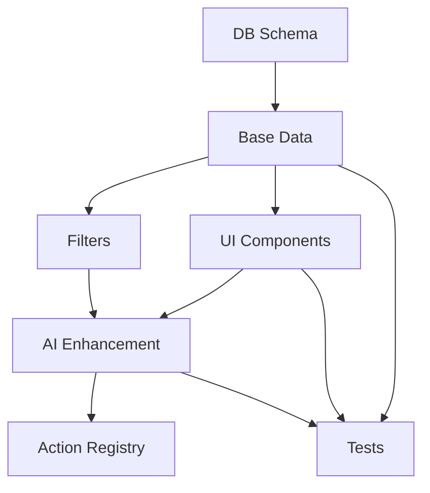

## NSW Government RAG Career Intelligence System — Overview

### Purpose

To build a public-facing, AI-powered career exploration and workforce mobility platform using a Retrieval-Augmented Generation (RAG) architecture. This will help individuals navigate NSW Government careers and provide departments with workforce insights and planning tools.

### Core Components

#### Role Pages

* Summary of responsibilities, required capabilities, skills, classification, and agency/division.
* Links to related roles and transitions.

#### Transition Pages

* Explain how to move from one role to another.
* Highlights gaps and readiness, with AI-generated development plans.

#### General Role Ontology

* Groups similar roles across agencies.
* Enables shared transitions and planning across variants.

#### Skills and Capabilities Pages

* Describe what each skill/capability is.
* Show where it is required and how to develop it.

#### Career Pathways Graph

* Visual progression paths.
* Lateral, vertical, and pivot opportunities.

#### Faceted Discovery

* Filter content by:

  * Taxonomy (function or theme)
  * Region
  * Division
  * Classification level
  * Skill/capability

#### Public UX Entry Points

* Start with Role / Person / Insight / Conversation
* Search or filter entry via homepage

#### Sidebar Dynamics

* Filter panel or history depending on context
* Dynamically changes across pages

#### RAG Engine

* Index job ads, roles, skills, capabilities, transitions.
* Embed and retrieve content semantically.
* Use prompt templates to generate natural language outputs.

### Use Cases

* Career development for public sector staff
* Internal mobility and retention
* Department-level planning
* Public awareness of role opportunities

### Optional Add-Ons

* Resume matching
* Talent dashboards
* Inclusion insights (e.g. First Nations, remote roles)
* Predictive vacancy or gap detection

### Next Steps

* Finalize data sources
* Wireframe all major page types
* Implement caching and generation workflows
* Pilot across a lead agency (e.g. DCCEEW)

---

## Implementation Plan

### Phase 1: Data Foundation
**Goal:** Establish base data access for all entities without AI enhancement
- Set up database tables and relationships
- Implement data edge function with basic querying
- Create frontend data service layer
- Implement basic filtering

**Success Criteria:**
- ✓ All entity types queryable through data endpoint
- ✓ Basic filtering working at database level
- ✓ Type-safe data access layer in frontend
- ✓ Unit tests passing for data access
- ✓ E2E tests passing for basic queries

### Phase 2: UI Components & Navigation
**Goal:** Build UI components that work with base data
- Implement entity list and detail views
- Create filter UI components
- Build navigation structure
- Implement URL-based state management

**Success Criteria:**
- ✓ All entity types have working list/detail views
- ✓ Filter UI working with URL sync
- ✓ Navigation between related entities working
- ✓ Responsive design implemented
- ✓ Accessibility requirements met

### Phase 3: AI Enhancement Layer
**Goal:** Add AI-powered insights and relationships
- Implement AI actions without registry integration
- Add progressive enhancement to UI
- Set up caching for AI results
- Implement semantic search

**Success Criteria:**
- ✓ AI enhancements loading after base data
- ✓ Caching working correctly
- ✓ Semantic search producing relevant results
- ✓ Performance metrics within targets
- ✓ Cost monitoring in place

### Phase 4: Action Registry Integration
**Goal:** Connect AI actions to the system
- Register actions in registry
- Implement action orchestration
- Add monitoring and logging
- Set up error handling and retries

**Success Criteria:**
- ✓ Actions registered and discoverable
- ✓ Monitoring showing correct usage
- ✓ Error handling working as expected
- ✓ System handling load efficiently

## Implementation Progress Tracker

| Entity/Feature              | DB Schema | Base Data | UI Components | Filters | AI Enhancement | Action Registry | Tests | Done |
|----------------------------|:---------:|:---------:|:-------------:|:-------:|:--------------:|:---------------:|:-----:|:----:|
| **Core Entities**          |           |           |               |         |                |                 |       |      |
| General Roles              |           |           |               |         |                |                 |       |      |
| Specific Roles             |           |           |               |         |                |                 |       |      |
| Capabilities               |           |           |               |         |                |                 |       |      |
| Skills                     |           |           |               |         |                |                 |       |      |
| Taxonomies                 |           |           |               |         |                |                 |       |      |
| **Relationships**          |           |           |               |         |                |                 |       |      |
| Role Transitions           |           |           |               |         |                |                 |       |      |
| Capability Requirements    |           |           |               |         |                |                 |       |      |
| Skill Requirements         |           |           |               |         |                |                 |       |      |
| **Insights**              |           |           |               |         |                |                 |       |      |
| Career Pathways            |           |           |               |         |                |                 |       |      |
| Capability Heatmaps        |           |           |               |         |                |                 |       |      |
| Skill Gap Analysis         |           |           |               |         |                |                 |       |      |
| **Infrastructure**         |           |           |               |         |                |                 |       |      |
| Data Edge Function         |           |           |               |         |                |                 |       |      |
| Frontend Data Service      |           |           |               |         |                |                 |       |      |
| Filter System             |           |           |               |         |                |                 |       |      |
| Caching Layer             |           |           |               |         |                |                 |       |      |
| **Cross-Cutting**         |           |           |               |         |                |                 |       |      |
| Error Handling            |           |           |               |         |                |                 |       |      |
| Monitoring                |           |           |               |         |                |                 |       |      |
| Performance Optimization  |           |           |               |         |                |                 |       |      |
| Documentation            |           |           |               |         |                |                 |       |      |

### Legend
- ⬜ Not Started
- 🟨 In Progress
- ✅ Complete
- ❌ Blocked

### Dependencies

### Risk Mitigation

1. **Data Quality**
   - Early validation of data sources
   - Clear data cleaning procedures
   - Regular data quality checks

2. **Performance**
   - Performance budgets defined
   - Monitoring from day one
   - Caching strategy validated

3. **Cost Control**
   - AI usage monitoring
   - Cost thresholds defined
   - Optimization triggers identified

4. **User Experience**
   - Progressive enhancement ensures basic functionality
   - Clear loading states
   - Graceful degradation paths

### Review Points

Define success criteria met when:
- All automated tests passing
- Performance metrics within budget
- Accessibility requirements met
- Security review completed
- Documentation updated
- User acceptance criteria met

### Monitoring Metrics

Track for each phase:
- Error rates
- Response times
- Cache hit rates
- AI cost per request
- User engagement metrics
- System load metrics
