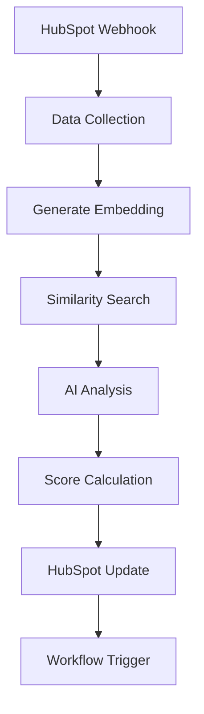

# Process Flow Documentation

## Client Onboarding Process

### 1. OAuth Authorization Flow

#### Send OAuth Link
```
https://app.hubspot.com/oauth/authorize
  ?client_id=<YOUR_CLIENT_ID>
  &redirect_uri=<YOUR_REDIRECT_URI>
  &scope=contacts.read%20contacts.write%20deals.read%20deals.write
```

Required Scopes:
- `contacts.read`
- `contacts.write`
- `deals.read`
- `deals.write`

#### Handle OAuth Callback
1. Client approves access
2. HubSpot redirects to callback URL:
   ```
   https://yourapp.com/auth/callback?code=<CODE>
   ```
3. Exchange code for tokens:
   - Access token
   - Refresh token

#### Token Storage
Store in Supabase with security measures:
- AES-256 encryption for tokens
- Client metadata storage:
  - Client ID
  - HubSpot portal ID
  - Creation timestamp
  - Last refresh timestamp

### 2. Initial Setup Process

#### Data Import
1. Load ideal client profile data
   - Source: CSV file
   - Required fields:
     - Industry
     - Company size
     - Revenue range
     - Geographic location
     - Technology stack
     - Budget range

2. HubSpot Data Pull
   - Contact records
   - Company information
   - Deal history
   - Engagement data

#### Data Processing
1. Generate Embeddings
   ```javascript
   // Example embedding generation
   {
     "client_id": "123",
     "embedding": [...], // 1536-dimensional vector
     "metadata": {
       "industry": "Technology",
       "size": "100-500",
       "location": "US"
     }
   }
   ```

2. Store in Pinecone
   - Vector embeddings
   - Associated metadata
   - Relevant tags

## Lead Scoring Process

### 1. Trigger Events
- New lead creation
- Lead data update
- Company information change
- Engagement activity

### 2. Data Collection
```javascript
{
  lead: {
    contact: {/* HubSpot contact data */},
    company: {/* Associated company data */},
    engagements: [{/* Recent interactions */}],
    deals: [{/* Deal history */}]
  }
}
```

### 3. Scoring Pipeline

#### Generate Lead Embedding
1. Process lead data
2. Create OpenAI embedding
3. Store for future reference

#### Similarity Analysis
1. Query Pinecone for matches
   ```javascript
   {
     "vector": [...], // Lead embedding
     "topK": 5,
     "filter": {
       "status": "active",
       "type": "ideal_client"
     }
   }
   ```

2. Process similarity scores

#### AI Analysis
Input to ChatGPT:
```javascript
{
  "lead_data": {/* Current lead information */},
  "similar_clients": [{/* Top Pinecone matches */}],
  "ideal_profile": {/* Ideal client criteria */}
}
```

Expected Output:
```javascript
{
  "score": 85, // 0-100
  "fit_level": "High", // High/Medium/Low
  "next_action": "Call", // Call/Email/Nurture
  "reasoning": "..." // Explanation of score
}
```

### 4. HubSpot Update

#### Field Updates
```javascript
{
  "properties": {
    "ai_lead_score": "85",
    "ai_lead_fit": "High",
    "ai_next_best_action": "Call",
    "ai_last_scored": "2024-02-20T10:00:00Z"
  }
}
```

#### Workflow Triggers
- High priority (score ≥ 80):
  - Immediate sales notification
  - Priority queue placement
- Medium priority (score 50-79):
  - Regular follow-up queue
- Low priority (score < 50):
  - Nurture campaign assignment

## Error Handling

### Retry Strategy
1. API Calls: 3 attempts with exponential backoff
2. Embedding Generation: 2 attempts
3. Score Updates: Queue-based retry system

### Fallback Mechanisms
1. Token refresh on 401 errors
2. Default scoring on AI service failure
3. Webhook retry queue for failed updates

## Monitoring

### Health Checks
- API connectivity status
- Token validity
- Queue processing status
- Error rate monitoring

### Performance Metrics
- Processing time per lead
- API response times
- Embedding generation speed
- Update success rate

## Data Flow Diagram


## Security Considerations

### Data Protection
- Encryption at rest and in transit
- Token rotation schedule
- Access logging
- PII handling compliance

### Access Control
- Role-based permissions
- API key management
- Audit trail maintenance

## Maintenance Tasks

### Daily
- Monitor webhook health
- Check error logs
- Verify token validity

### Weekly
- Review scoring patterns
- Update ideal client profiles
- Optimize embeddings

### Monthly
- Performance analysis
- Model retraining
- System optimization 